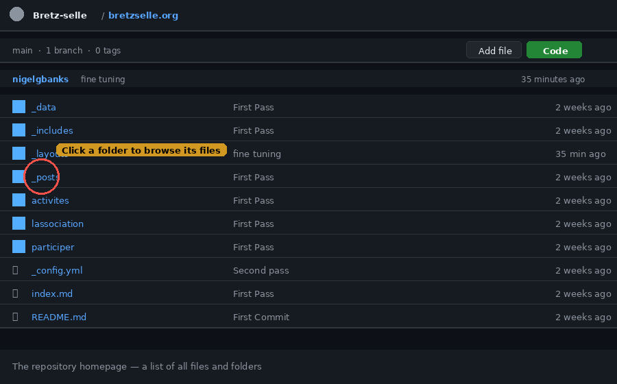
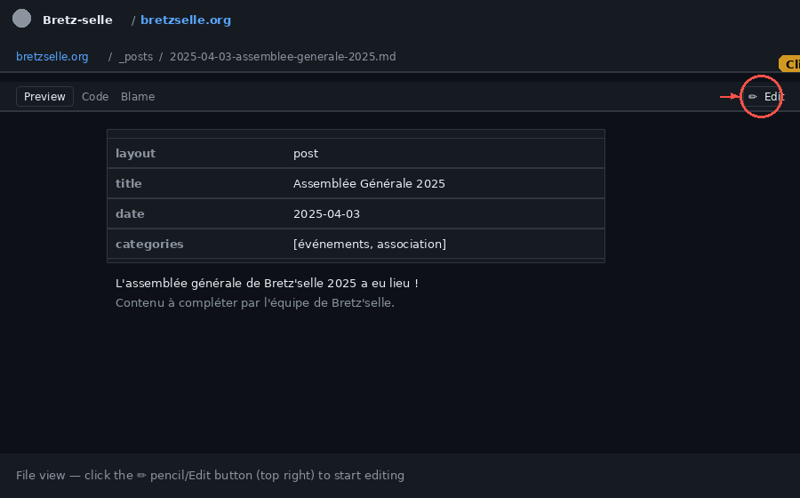
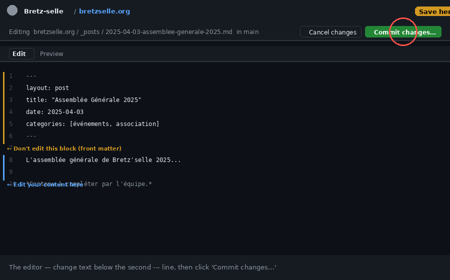
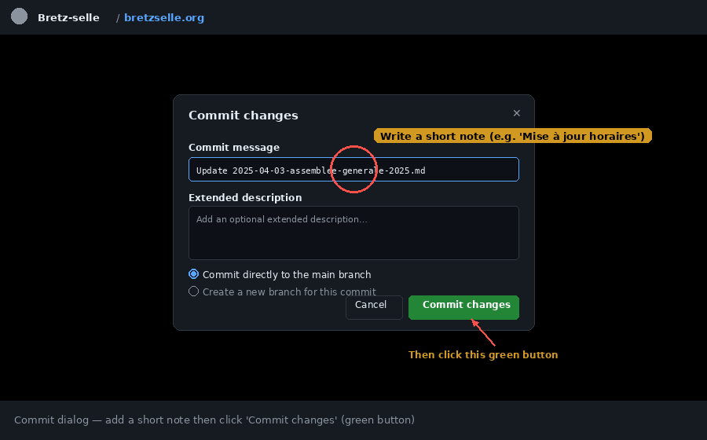
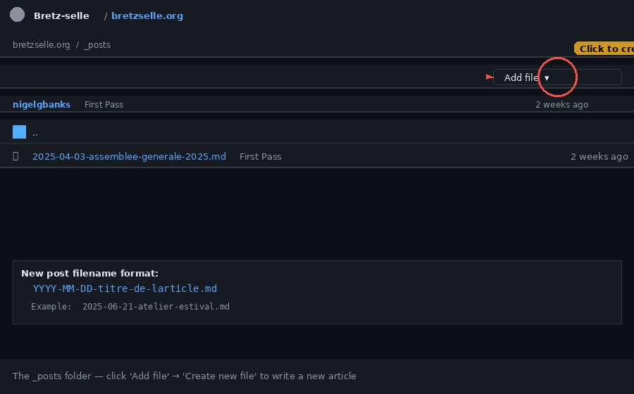

# Guide de mise à jour du site Bretz'selle

This guide explains how to update the Bretz'selle website directly through GitHub — **no technical knowledge required, no software to install**. All you need is a GitHub account and access to this repository.

---

## How it works

The website is built with a system called **Jekyll** and hosted for free on **GitHub Pages**. Every time someone saves a change to a file in this repository, GitHub automatically rebuilds and republishes the site within about 1–2 minutes. You don't need to touch any servers or run any commands — just edit the file and save.

```
You edit a file on GitHub → GitHub rebuilds the site → bretzselle.org updates automatically
```

---

## A quick introduction to Markdown

All the content pages on this site are written in **Markdown** — a simple way of writing formatted text using plain characters. Here are the basics:

```markdown
# Big heading (H1)
## Medium heading (H2)
### Small heading (H3)

Normal paragraph text. Just write sentences.
Leave a blank line between paragraphs.

**bold text**
*italic text*

- A bullet point
- Another bullet point

[Link text](https://example.com)


```

That's genuinely all you need for 90% of edits on this site. GitHub also shows a **Preview** tab when editing so you can see how things will look before saving.

---

## Map of files to pages

Here is every editable file and the page it controls on the live site:

### Homepage & top-level pages

| File | Live page |
|------|-----------|
| `index.md` | [bretzselle.org/](https://bretzselle.org/) — the homepage |
| `adherer.md` | [bretzselle.org/adherer/](https://bretzselle.org/adherer/) — membership page |
| `actualites.md` | [bretzselle.org/actualites/](https://bretzselle.org/actualites/) — news listing |

### L'association section

| File | Live page |
|------|-----------|
| `lassociation/index.md` | [bretzselle.org/lassociation/](https://bretzselle.org/lassociation/) |
| `lassociation/esprit.md` | [bretzselle.org/lassociation/esprit/](https://bretzselle.org/lassociation/esprit/) — L'esprit Bretz'selle |
| `lassociation/fonctionnement.md` | [bretzselle.org/lassociation/fonctionnement/](https://bretzselle.org/lassociation/fonctionnement/) |
| `lassociation/historique.md` | [bretzselle.org/lassociation/historique/](https://bretzselle.org/lassociation/historique/) |
| `lassociation/liens.md` | [bretzselle.org/lassociation/liens/](https://bretzselle.org/lassociation/liens/) — Les liens des copain·es |

### Activités section

| File | Live page |
|------|-----------|
| `activites/index.md` | [bretzselle.org/activites/](https://bretzselle.org/activites/) |
| `activites/atelier-auto-reparation.md` | [bretzselle.org/activites/atelier-auto-reparation/](https://bretzselle.org/activites/atelier-auto-reparation/) |
| `activites/perm-des-boucherxs.md` | [bretzselle.org/activites/perm-des-boucherxs/](https://bretzselle.org/activites/perm-des-boucherxs/) |
| `activites/apero-demontage.md` | [bretzselle.org/activites/apero-demontage/](https://bretzselle.org/activites/apero-demontage/) |

### Participer section

| File | Live page |
|------|-----------|
| `participer/index.md` | [bretzselle.org/participer/](https://bretzselle.org/participer/) |
| `participer/devenir-benevole.md` | [bretzselle.org/participer/devenir-benevole/](https://bretzselle.org/participer/devenir-benevole/) |
| `participer/donner-un-velo.md` | [bretzselle.org/participer/donner-un-velo/](https://bretzselle.org/participer/donner-un-velo/) |
| `participer/se-tenir-informe.md` | [bretzselle.org/participer/se-tenir-informe/](https://bretzselle.org/participer/se-tenir-informe/) |

### Special data files (no Markdown knowledge needed)

| File | What it controls |
|------|-----------------|
| `_data/hours.yml` | Workshop opening hours — shown on the homepage and in the footer |
| `_data/contact.yml` | Address, phone number, email |

### News posts

All news articles live in the `_posts/` folder. Each file is named `YYYY-MM-DD-slug.md`.

---

## How to edit an existing page

**Step 1 — Navigate to the file**

Go to [github.com/Bretz-selle/bretzselle.org](https://github.com/Bretz-selle/bretzselle.org). You'll see a list of folders and files. Click into the folder for the page you want to edit (e.g. `activites/`), then click the filename.



**Step 2 — Open the editor**

You'll see the file contents displayed. In the top-right corner of the file, click the **pencil icon** (✏️) labelled "Edit this file".



**Step 3 — Make your changes**

The file will open in a text editor. The top section between the `---` lines is called **front matter** — it contains metadata like the page title. **Don't edit this section** unless you know what you're changing. Edit only the content below the second `---`.



You can click the **Preview** tab at the top of the editor to see how your changes will look before saving.

**Step 4 — Save (commit) your changes**

When you're done, click the green **"Commit changes…"** button in the top-right corner.

A dialog will appear:



- **Commit message** — a short note describing what you changed (e.g. `"Mise à jour des horaires"`). This is just for the history log; it doesn't appear on the website.
- Leave the radio button on **"Commit directly to the main branch"**.
- Click the green **"Commit changes"** button.

The site will automatically rebuild. Wait 1–2 minutes, then refresh the live page to see your update.

---

## How to write a new news post

News articles are stored in the `_posts/` folder. Each file must be named with the date first, in the format `YYYY-MM-DD-titre-de-l-article.md`.

**Step 1 — Go to the `_posts` folder**

From the repository homepage, click the `_posts` folder.



**Step 2 — Create a new file**

Click the **"Add file"** button (top right of the file list), then choose **"Create new file"**.

**Step 3 — Name the file**

In the filename box at the top, type the filename. The format must be:

```
YYYY-MM-DD-mon-titre.md
```

For example: `2025-06-21-atelier-estival.md`

**Step 4 — Add the front matter and content**

Every post must start with this block (copy and paste it, then fill in your details):

```yaml
---
layout: post
title: "Titre de l'article"
date: 2025-06-21
categories: [événements]
---
```

Then write your article content below the second `---` line, using Markdown.

A complete example:

```markdown
---
layout: post
title: "Atelier estival — juillet 2025"
date: 2025-06-21
categories: [événements]
---

Venez réparer votre vélo cet été ! Nous ouvrons des créneaux supplémentaires 
pendant les vacances scolaires.

## Programme

- **5 juillet** — atelier spécial roues
- **19 juillet** — permanence normale

Pour plus d'informations, contactez-nous à l'atelier.
```

**Step 5 — Commit**

Click **"Commit changes…"** (top right), add a short message, and click **"Commit changes"**. The post will appear on [bretzselle.org/actualites/](https://bretzselle.org/actualites/) within 1–2 minutes.

---

## How to update the opening hours

Opening hours are stored in a simple data file — no Markdown needed.

**Step 1** — From the repository homepage, click the `_data` folder, then click `hours.yml`.

**Step 2** — Click the pencil icon (✏️) to edit.

**Step 3** — The file looks like this:

```yaml
- day: lundi
  hours: "18h–20h30"
  note: "Bouchèrxs*"
- day: mardi
  hours: "14h–20h30"
- day: mercredi
  hours: "17h–20h30"
- day: jeudi
  hours: "16h30–20h"
  note: "bénévole"
- day: vendredi
  hours: "11h–17h30"
- day: samedi
  hours: "14h–17h30"
```

Change only the values in `"quotes"` — for example, change `"14h–20h30"` to `"15h–20h"`. **Do not change the structure** (the `- day:` and `hours:` parts).

**Step 4** — Click **"Commit changes…"**, add a message like `"Mise à jour horaires mardi"`, and commit. The new hours will appear on the homepage and in the footer automatically.

---

## How to update the contact information

Contact details work the same way as hours. Click the `_data` folder, then `contact.yml`. Edit the values in quotes, then commit.

---

## How to check if the site deployed successfully

After committing a change, GitHub rebuilds the site automatically. To check the status:

1. Go to the repository homepage: [github.com/Bretz-selle/bretzselle.org](https://github.com/Bretz-selle/bretzselle.org)
2. Look at the small icon next to the latest commit message at the top of the file list:
   - 🟡 **Yellow dot** — the site is currently rebuilding (wait a moment)
   - ✅ **Green tick** — the site has deployed successfully
   - ❌ **Red cross** — there was an error (see tips below)
3. If you need more detail, click the **"Actions"** tab at the top of the repository page to see the full build log.

---

## Tips and common mistakes

**Don't break the front matter.** The section between the two `---` lines at the top of each file is sensitive. Don't delete the `---` lines, don't add extra spaces before `title:` or `date:`, and keep the title in quotes. If the site fails to build after your edit, this is the most likely cause.

**Dates in post filenames must match the `date:` field.** If your file is named `2025-06-21-article.md`, the `date:` line inside must also be `2025-06-21`.

**Leave a blank line between paragraphs.** In Markdown, text on consecutive lines without a blank line between them will merge into one paragraph. If your text isn't breaking into separate paragraphs, add a blank line.

**The site takes 1–2 minutes to update.** After committing, wait a moment before checking the live site. A hard refresh (Ctrl+Shift+R on Windows/Linux, Cmd+Shift+R on Mac) will bypass the browser cache.

**You can always undo.** GitHub keeps a full history of every change. If something goes wrong, contact someone with GitHub access — every change can be reversed.

---

## Need help?

If the site isn't updating or something looks broken, check the **Actions** tab on the repository page. The build log will usually explain what went wrong.
